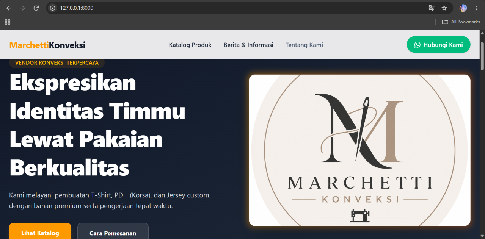
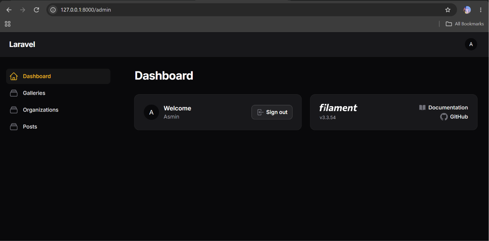
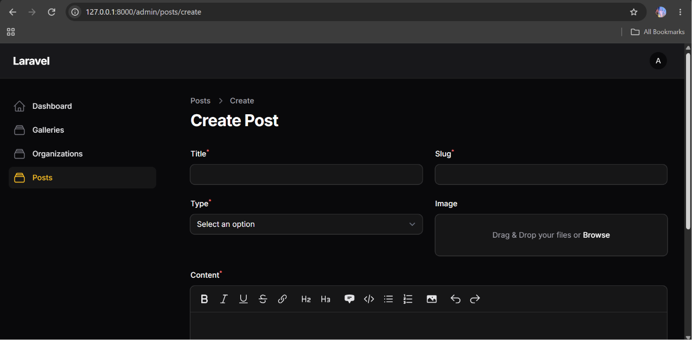

# Web Company Profile Konveksi Marchetti

Website company profile untuk **Konveksi Marchetti**, dibangun menggunakan framework **Laravel** dengan admin panel **Filament**. Website ini dibuat untuk menampilkan profil perusahaan konveksi, berita/informasi terbaru, galeri produk, struktur organisasi, serta memudahkan calon pelanggan melakukan pemesanan langsung melalui WhatsApp.

---

## 📌 Tentang Website

Website ini merupakan tugas mata kuliah **Rekayasa Web**, dibuat sebagai media promosi dan informasi resmi untuk Konveksi Marchetti. Pengunjung dapat melihat informasi perusahaan, berita, galeri produk, dan struktur organisasi, sedangkan admin dapat mengelola seluruh konten melalui panel admin berbasis Filament.

---

## ✨ Fitur

### Front End (Halaman Pengunjung)
- Halaman **Beranda** menampilkan profil perusahaan Konveksi Marchetti
- Halaman **Berita & Informasi** terbaru
- Halaman **Galeri Foto Produk**
- Halaman **Struktur Organisasi**
- Fitur **Pemesanan langsung via WhatsApp** tanpa perlu login

### Back End (Admin Panel - Filament)
- **Autentikasi login** admin
- **CRUD Berita & Informasi**
- **CRUD Galeri Foto Produk**
- **CRUD Struktur Organisasi**
- Dashboard admin untuk mengelola seluruh konten website

### Keunggulan
- Admin panel modern dan responsif menggunakan **Filament v3**
- Proses pemesanan terintegrasi langsung ke **WhatsApp**, tanpa perlu sistem checkout rumit
- Manajemen konten (berita, galeri, struktur organisasi) mudah dilakukan tanpa perlu coding
- Tampilan Front End sederhana, ringan, dan mudah dinavigasi oleh pengunjung

---

## 🛠️ Teknologi yang Digunakan

- PHP 8.5
- Laravel 13
- Filament v3 (Admin Panel)
- MySQL
- XAMPP

---

## 📸 Screenshot Aplikasi

### 1. Halaman Dashboard Front End


### 2. Halaman Dashboard Back End (Admin Panel)


### 3. Halaman Input Data (Contoh: Input Berita/Informasi)


---

## 🚀 Cara Instalasi

1. **Clone repository**
   ```bash
   git clone https://github.com/Fannan10/web_konveksi.git
   cd web_konveksi
   ```

2. **Install dependency**
   ```bash
   composer install
   ```

3. **Copy file .env**
   ```bash
   cp .env.example .env
   php artisan key:generate
   ```

4. **Setup database**

   Buat database baru bernama `web_konveksi` di MySQL (via phpMyAdmin atau CLI), lalu sesuaikan file `.env`:
   ```
   DB_CONNECTION=mysql
   DB_HOST=127.0.0.1
   DB_PORT=3306
   DB_DATABASE=web_konveksi
   DB_USERNAME=root
   DB_PASSWORD=
   ```

   Kamu bisa memilih salah satu cara berikut untuk mengisi struktur & data database:

   **Opsi A — Import file SQL (lebih cepat, data sudah terisi)**
   Import file `database/web_konveksi.sql` ke database `web_konveksi` melalui phpMyAdmin:
   - Buka phpMyAdmin → pilih database `web_konveksi`
   - Klik tab **Import** → pilih file `database/web_konveksi.sql` → klik **Go**

   **Opsi B — Jalankan migration (database kosong, tanpa data contoh)**
   ```bash
   php artisan migrate
   ```

5. **Storage link**
   ```bash
   php artisan storage:link
   ```

6. **Buat user admin** *(lewati langkah ini jika sudah import SQL dan sudah ada user admin di dalamnya)*
   ```bash
   php artisan make:filament-user
   ```

7. **Jalankan server**
   ```bash
   php artisan serve
   ```

8. **Akses admin panel**
   ```
   http://127.0.0.1:8000/admin
   ```

---

## 🗄️ Struktur Database

| Tabel | Keterangan |
|---|---|
| `users` | Data admin login |
| `posts` | Data berita dan informasi |
| `galleries` | Data foto galeri produk |
| `organizations` | Data struktur organisasi |

---

## 🌐 Link Demo

Website Konveksi Marchetti yang sudah di-hosting:
👉 [https://web-konveksi.onrender.com](https://web-konveksi.onrender.com)

---

## 👥 Developer / Tim Kelompok

| No | Nama | NIM |
|---|---|---|
| 1 | Muhammad Yasir Shiddiq | 24030001 |
| 2 | Muhammad Fannan Pratama | 24030020 |
| 3 | Luqman Wijaya | 24030027 |

**Mata Kuliah:** Rekayasa Web
